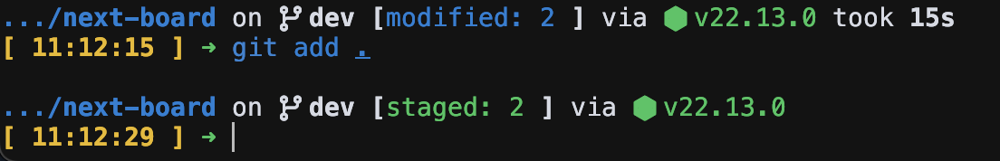

# Config of fish shell and starship prompt

- [fish shell](https://fishshell.com/)
- [starship](https://starship.rs/)

I use starship to dispaly git status, git branch, and Node.JS version...etc
  

