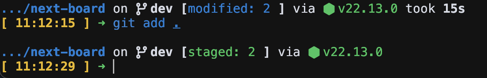

# Config bundle of my terminal tools

- [ghostty](https://github.com/ghostty-org/ghostty)
- [fish shell](https://fishshell.com/)
- [starship](https://starship.rs/)

I chose them because they are lightweight, fast, and powerful.

- Cmux: Ghostty-based macOS terminal with vertical tabs and notifications for AI coding agents. (It is my default terminal)
- 👻 Ghostty is a fast, feature-rich, and cross-platform terminal emulator that uses platform-native UI and GPU acceleration. (`ghostty.conf` is a copy of the configuration file for Ghostty, not the real copy)
- Fish is a smart and user-friendly command line shell for Linux, macOS.
- Starship is minimal, blazing-fast, and infinitely customizable prompt for any shell, which can display git status, git branch, and Node.JS version...etc

